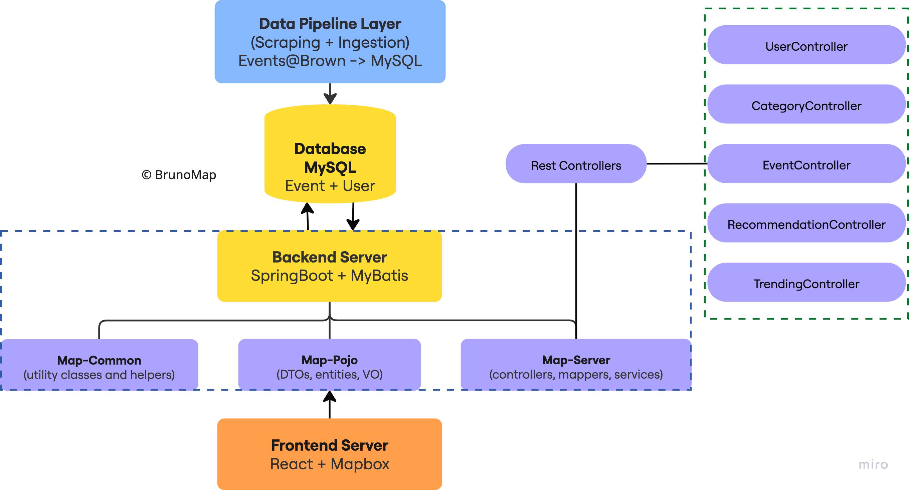
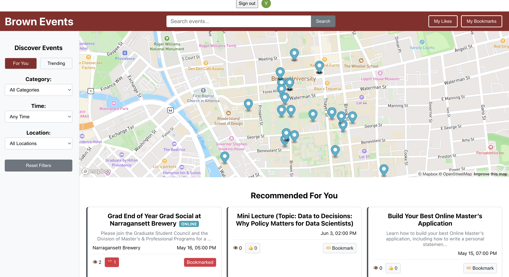
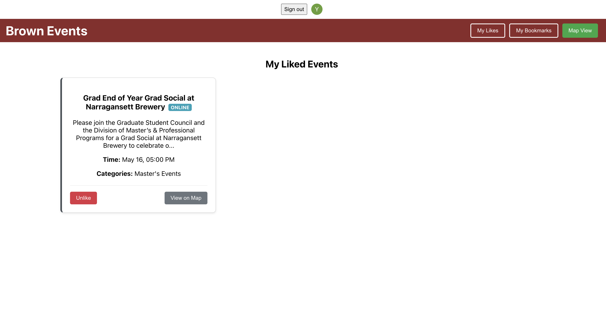
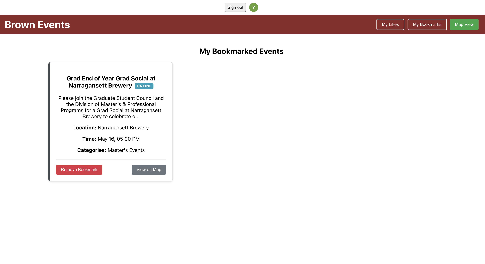

# term-project BrunoMap



# Project Details

**BrunoMap** is a map-based event discovery platform tailored for Brown students, powered by personalized recommendations. Our project addresses a key gap in existing tools like the BrownU app and Today@Brown, which list events but lack an interactive, location-based interface. Without a dynamic and personalized way to explore events, students may overlook opportunities that could enrich their campus experience. BrunoMap offers a more engaging solution --- integrating event listings with an interactive map to help students easily discover, plan, and attend events based on their location, interests, and schedule.

### Functionalities

- **Interactive Map View**: Explore upcoming events geographically across campus.
- **Personalized Recommendations**: See events tailored to your interests and past activity along with a mix of trending and surprise events for fun and spontaneous discovery!
- **Trending Events**: Quickly find popular or highly-liked events among students.
- **Category Filtering**: Browse events by categories such as arts, sports, academics, and more.
- **Bookmark & Like**: Save events of interest and express preferences to enhance recommendations.
- **Event Details**: View comprehensive event info including time, location, and description.
- **Authentication Support**: Sign in securely using Clerk to access personalized features.

Here are the snapshots:





# Design Choices
## Frontend Development and Backend Integration
### Frontend Development
**React with TypeScript**: 

We chose React for its component-based architecture, which allowed us to build reusable UI elements. TypeScript provided type safety, improving code quality and developer experience through early error detection.

**Three-View Architecture**: 

We implemented a clear separation between the Map view, Likes view, and Bookmarks view to create a focused user experience for each task.

**Mapbox GL Integration**: 

We selected Mapbox for its powerful interactive mapping capabilities, customizable markers, and smooth animations for location transitions.
State Management: We used React's useState and useEffect hooks for local component state and side effects, avoiding the complexity of additional state management libraries.

**Responsive Design**: 

All components were designed to adapt to different screen sizes, ensuring a consistent experience across devices.

**Optimistic UI Updates**: 

User actions like likes and bookmarks immediately update the UI before backend confirmation, creating a more responsive feel.

### Backend Integration

**Service Layer Pattern**: 

We centralized all API communication in api.ts, creating a clean separation between data fetching and UI rendering.

**Parameterized Endpoints:**

Our API functions accept filter parameters, allowing the same endpoint to be reused in different contexts with varying criteria.

**Authentication Integration:**

We used Clerk to manage user authentication, passing the userId to relevant API calls for personalized features.

**Error Handling**: 

We implemented consistent error handling across all API calls, with appropriate fallbacks when services are unavailable.

### SQL Injection Prevention

#### Parameter Binding Strategy
We use MyBatis's `#{}` parameter binding syntax instead of `${}` string substitution for all SQL queries. This choice is based on the following comparison:

| Syntax | Parameter Binding | SQL Injection Risk | Usage in Our Project |
|--------|------------------|-------------------|---------------------|
| `#{}`  | ✅ Pre-compiled via JDBC | ❌ Safe, prevents injection | ✅ Used for all user inputs |
| `${}`  | ❌ Direct text substitution | ⚠️ Vulnerable to injection | ❌ Not used for user inputs |

##### Why `#{}`?
- Uses JDBC PreparedStatement for parameter binding
- Automatically escapes special characters
- Prevents SQL injection attacks
- Example:
  ```java
  @Select("SELECT * FROM events WHERE event_id = #{eventId}")
  ```
  Gets converted to:
  ```sql
  SELECT * FROM events WHERE event_id = ?
  ```
  Then safely bound via PreparedStatement

##### Why Not `${}`?
- Direct text substitution in SQL
- Vulnerable to SQL injection
- Example of risk:
  ```java
  // UNSAFE: Using ${} for user input
  @Select("SELECT * FROM events WHERE name = ${userInput}")
  ```
  If userInput = "'; DROP TABLE events; --"
  Results in:
  ```sql
  SELECT * FROM events WHERE name = ''; DROP TABLE events; --'
  ```

#### Framework Implementation
While our code imports from the `org.apache.ibatis` package, we are using MyBatis (not iBatis). This is because:
1. MyBatis maintains backward compatibility with the original iBatis package structure
2. The `org.apache.ibatis` namespace is the official package name for MyBatis
3. The actual framework version and functionality are from MyBatis, as confirmed by our dependencies:
   ```xml
   <dependency>
       <groupId>org.mybatis.spring.boot</groupId>
       <artifactId>mybatis-spring-boot-starter</artifactId>
   </dependency>
   ```
   
# Testing

We have implemented an extensive testing suite, including backend unit tests, Postman tests for API endpoints, and frontend-backend integration tests.

- **Backend unit tests** are located in `server/map/map-server/src/test/java/com/map/service`.
- **Postman tests** covering the full recommendation flow can be found in `server/bruno-map-nonrec.postman_collection.json` and `server/bruno-map-rec.postman_collection.json`.
- **Frontend-backend integration tests** are available in `client/tests/e2e`. - `npx playwright test App.spec.ts --workers 1`

In addition to automated testing, our team has conducted thorough manual testing by interacting with the app to verify expected behaviors.

That said, further testing would be necessary to ensure reliability and scalability as the project grows.

# How to

### 1. Data Preparation

Before running BrunoMap, make sure the event data is manually updated and inserted into the MySQL database (You can find them in `scraper` folder). Ensure that `map/map-server/src/main/resources/application.yml` is updated with the correct database connection details, especially the credentials, ports, db name, root username and password.

> While automated scraping is in place, data upload to the database is still manual. We plan to automate this step using a scheduled cron job after the demo phase.

### 2. Start the Backend Server

From the root of the project, navigate to the backend module:

```bash
cd server/map/map-server
```

Build and run the Spring Boot server:

```bash
mvn clean compile;
mvn clean install;
mvn spring-boot:run -pl map-server;
```

### 3. Start the Frontend Server

In a separate terminal, navigate to the frontend client:

```bash
cd client
```

Install dependencies if not already installed:

```bash
npm install
```

Start the development server:

```bash
npm run start
```

By default, the frontend should be running at `http://localhost:8000/` and communicate with the backend at `http://localhost:8080`.

### 4. Interact with BrunoMap

You can now explore events on an interactive map, filter by category, view trending/recommended events, and use the like/bookmark features!


### 5. Scrape Brown Events

1. Navigate to the scraper/ directory.
2. Make sure you're using the Python virtual environment:
    - If not already created, set it up and install dependencies:
    `pip3 install -r requirements.txt`
    - Activate the environment:
    `source env/bin/activate`
3. Run the crawler:
    `python main_crawler.py`

# Collaboration

**Yumian Cui (ycui39)**: Yumian designed the recommendation strategy, finalized the API endpoint specifications, and implemented both the recommendation and trending API endpoints. She also supported backend debugging efforts to ensure proper functionality, communicated closely with the frontend to support smooth integration, and tested the entire recommendation pipeline through both unit and integration testing.

**Yunqi Li (yli795)**: Yunqi implemented a comprehensive frontend for the BrunoMap application using React and TypeScript, creating an intuitive interface with three main views: a map-based discovery system using Mapbox, a personalized likes collection, and a bookmarks section. She developed a robust filtering system for events by category, time, and location, while ensuring responsive design across devices. For backend integration, Yunqi designed a centralized service layer that manages all API communications, implementing optimistic UI updates for user interactions and efficient state management. She established proper authentication flow, enabling event engagement tracking and user-specific content display, while maintaining clean separation between data fetching and UI rendering components.

**Yuki Zang (mzang2)**: Yuki designed the relational database schema in MySQL to support event-related and user interaction features, and selected the backend technology stack including Java, Spring Boot, and MyBatis. She implemented all non-recommendation API endpoints, encompassing core functionalities such as event retrieval, filtering, search, and user-specific actions like viewing, bookmarking, and liking events. Yuki ensured efficient data access and consistency across endpoints, and collaborated closely with the frontend, recommendation, and data team members to support smooth integration and end-to-end system functionality.

**Lin Ning Kung (klinning)**: Lin Ning designed and implemented an automated event crawler to collect structured event data from the Brown University events calendar. Using Selenium in headless mode, the system navigates through event listings, extracts detailed information including event name, time, location, description, type, and related tags, and stores the data in a relational database. The crawler is designed to run regularly and avoid duplicate entries by tracking previously seen links. It also includes logging, error handling, and database insertion logic with support for category mapping. Lin also contributed to finalizing the database schema, ensuring support for location metadata to enable future geospatial features such as map-based event discovery.
